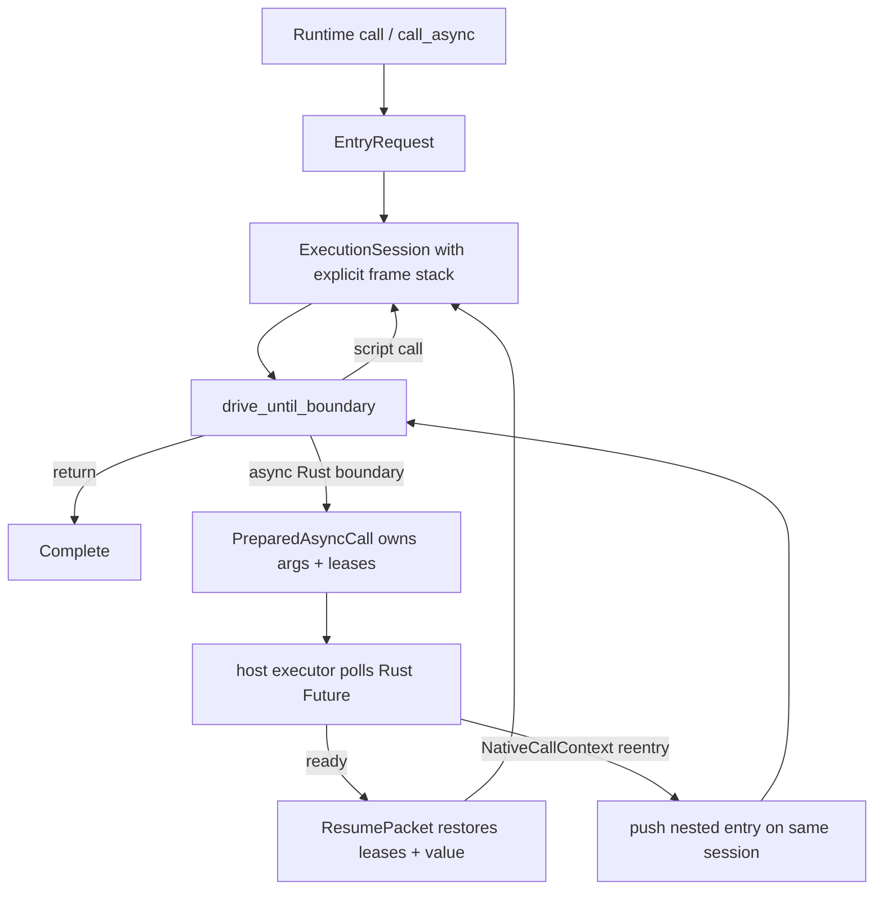

# Async Execution Model Architecture Plan

> **Track:** executor-neutral script suspension, Rust/Vela async interop,
> scoped host leases, and same-execution reentry
> **Document status:** ready for execution
> **Execution status:** Batches A-C complete; Batch D active
> **Baseline:** pulled `master` at `841a033d2` on 2026-07-13
> **Plan execution style:** throughput-first large batches. Intermediate
> compilation and tests may be red; each batch-completion checkpoint must be
> green.
> **Relationship to the roadmap:** this is a post-first-interpreter architecture
> track. Batch A activated async syntax, callable asyncness, explicit await IR,
> and the shared resumable execution foundation. Real Rust future suspension,
> host leases, and the remaining integration surface activate only at their
> later batch checkpoints.

This plan defines the long-term async architecture. It is not a short-term
adapter around the recursive VM, a Tokio integration, or a game-specific actor
patch. The implementation must hard-switch Vela to one resumable execution
model shared by synchronous and asynchronous entry points.

The motivating integration is a game-server handler that owns mutable actor
state, awaits Rust services, allows those services to call back into Vela, and
then resumes the original script. The resulting Vela APIs and runtime model must
remain domain-neutral and usable outside that integration.

---

## 0. Codex Goal

Use this prompt to execute the entire plan:

```text
/goal Execute docs/async-execution-model-plan.md in full.

This is one persistent, multi-turn implementation goal. The async plan, not an
unrelated next item from docs/goal.md, is the work queue for this goal. Continue
automatically across tasks, turns, batches, and commits until every completion
criterion in Section 18 is checked and validated. Finishing one phase, one
batch, one commit, one API surface, one test group, or one vertical slice is
progress only and is never a valid stopping condition.

Implement the long-term architecture directly:

1. Batch A: prove the safe Rust ownership shape for one scoped `Send` call
   future, carry asyncness through syntax/HIR/analysis/reflection/MIR, introduce
   explicit await control flow, consume call host state into an execution owner,
   and replace recursive VM script calls with one explicit execution-frame stack
   and driver.
2. Batch B: add the executor-neutral Rust-to-Vela async call surface and
   Vela-to-Rust async function plus HostPath-based method registration, using
   the same execution driver as sync calls.
3. Batch C: build safe typed shared/exclusive host leases on the execution-owned
   scopes, finish direct stateful struct methods, and implement same-execution
   NativeCallContext reentry, including mutable-state reborrows.
4. Batch D: close hot reload, cancellation, GC roots, execution budgets,
   reflection, providers, tooling, diagnostics, examples, documentation,
   compatibility, and performance acceptance.

Use the plan checklists as executable acceptance criteria. Work in substantial
batches and prefer one coherent Conventional Commit per completed batch.
Intermediate edits and recovery commits may fail to compile or test; do not
spend time preserving a green tree after every internal API/type change. Restore
the full required validation boundary before checking a batch complete. A red
intermediate state is not a reason to stop.

Do not create a second async interpreter, poll the recursive VM as a black box,
add a Tokio dependency to the core runtime, expose BoxFuture/LocalBoxFuture as
the semantic API distinction, require Runtime to be moved into tokio::spawn,
expose Rust references to scripts, keep CallArgsAdapter alive across await with
unsafe/self-references, add Engine/Runtime execution-mode generics or a parallel
`!Send` runtime path, multiply Runtime execution methods by function/method/
provider/adapter/raw/safe-point target shape, add compatibility execution modes,
or reset budgets and generation state during reentry. Workspace unsafe remains
forbidden.

Never mark the goal complete while any of the following is true:

- any Batch A-D or Section 18 checklist item is unchecked;
- script-to-script calls still recurse through Rust execute_linked_call frames;
- sync and async calls do not use the same execution driver;
- public Runtime execution has methods other than the single `call`/
  `call_async` pair, or a supported target cannot use that pair;
- CallArgsAdapter/GlobalStoreAdapter still form a borrowing execution stack
  instead of one execution-owned host boundary;
- the scoped Runtime call future or any registered async Rust future is not
  proven `Send` for its invocation lifetime;
- Runtime::call_async, async native functions, async struct methods, mutable
  host leases, or same-execution reentry is missing;
- cancellation can leave Runtime or a direct host binding permanently busy;
- suspended frames do not pin their LinkedArtifact and expose complete GC roots;
- provider, reflection, hot-reload ABI, tooling, or diagnostics asyncness is
  omitted;
- any required focused test, workspace validation command, zero-hit audit,
  example, or performance comparison has not passed;
- docs/progress.md and docs/decisions.md do not reflect every activated durable
  contract;
- the completed work is not committed with Conventional Commits or the final
  worktree is dirty.

If an implementation attempt fails, diagnose it and continue with another
in-scope safe-Rust design. Phase 0 exists to prove lifetime and auto-trait
details on the pinned Rust toolchain; it is not permission to weaken the target
contract. Report blocked only when progress genuinely requires an external
decision.
```

---

## 1. Pulled-Baseline Findings

The plan was rebuilt after the latest remote changes were pulled. The current
production path and the relevant constraints are:

1. Production execution already goes through Heavy HIR, owned verified MIR,
   linked executable generation, and `LinkedArtifact`. Async must extend that
   path; it must not bypass MIR or introduce another interpreter.
2. `RuntimeImpl` currently exposes synchronous `call`, `call_with_adapter`,
   `call_method`, raw-call, event-safe-point, and provider entry points. These
   are consolidation inputs, not a promise to clone every spelling for async.
   Provider execution already uses the ordinary linked script-method path, so a
   provider is another call target rather than another execution API or driver.
3. `vela_vm::linked_execution::execute_linked_call` owns a single `CallFrame`,
   while script functions, closures, script methods, guards, equality callbacks,
   and related paths recursively invoke it. A suspended execution cannot be
   built safely on top of this Rust-stack recursion.
4. `CallArgs<'a>` stores direct shared and mutable `ScriptHostObject` references.
   `CallArgsAdapter` borrows both `CallArgs` and the fallback adapter. Keeping
   that shape across `.await` would require a self-referential owner or unsafe;
   the workspace forbids unsafe and the architecture does not need it.
5. Direct host-object IDs restart from the same high-bit range for each
   `CallArgs`. Reentrant scopes therefore also need execution-wide identity,
   not independent per-call allocation.
6. Native functions, context natives, host natives, native methods,
   `ScriptHostObject::call_resolved_host`, and both registration macros are
   synchronous. The macros explicitly reject Rust async functions and methods.
7. Existing `TypedHostRef<T>` and `TypedHostMut<T>` are typed `HostPath` markers.
   They are not Rust object borrows and must not be silently repurposed as
   across-await leases.
8. `MirCall` and host calls are statements. `MirTerminatorKind` has no await or
   suspension edge. MIR liveness, safepoints, root-live maps, effects, linked
   identity, and generation ownership already provide the correct foundation
   for an explicit suspension terminator.
9. Syntax, HIR, callable metadata, the real reflection model, and executable
   metadata have no active asyncness contract. The aspirational `may_yield`
   example in the reflection architecture is not implemented and should not be
   treated as the design.
10. Runtime is `Send` but intentionally executes one call at a time. That is
    compatible with a scoped `Send` call future: `Send` means the borrowed
    future may migrate between executor threads; it does not mean the future is
    `'static`, detached, concurrent, or required to own Runtime.

Baseline checks run after the pull:

```text
cargo test -p vela_engine runtime_call_args_host_mut_dispatches_root_and_child_host_methods
cargo test -p vela_engine provider --lib
```

Both passed. Batch A must capture a broader pre-change validation and focused
performance baseline before production edits.

---

## 2. Required Use Cases

The completed model must support all of these without project-specific core
types:

1. Rust synchronously calls a synchronous Vela function.
2. Rust asynchronously calls either a synchronous or asynchronous Vela
   function while borrowing Runtime and host arguments for the call duration.
3. Vela calls a synchronous Rust free function.
4. Vela awaits an asynchronous Rust free function.
5. Vela calls synchronous methods on registered Rust structs with `&self` or
   `&mut self` receivers.
6. Vela awaits asynchronous methods on registered Rust structs.
7. An async registered Rust method holds an exclusive borrow of host state
   across an ordinary Rust `.await` and calls other Rust async services.
8. That Rust async method may reenter Vela before returning, explicitly
   reborrowing the mutable host state into the child Vela entry.
9. The outer Vela frame resumes after the Rust future and any nested Vela call
   finish.
10. Async execution produces one scoped `Send` future suitable for a `Send`
    actor-handler future without requiring Runtime ownership or `'static`
    arguments.
11. A suspended old-generation call survives a staged reload with its original
    code and resumes correctly; new outer calls use the new generation only
    after a safe activation point.
12. Dropping the outer call future cancels the execution and releases every
    host borrow without rolling back effects that already completed.

---

## 3. Scope And Non-Goals

### 3.1 In Scope

- `async fn` declarations and call-expression `.await`.
- Executor-neutral Rust futures based only on `std::future::Future` and
  `std::task` in core crates.
- One scoped `Send` async embedding contract with no Engine/Runtime mode
  parameter.
- One stackless linked VM execution driver for sync and async front doors.
- Explicit MIR/linked suspension and resume metadata.
- Async Rust free-function and struct-method registration, including macro
  ergonomics.
- Safe scoped shared/exclusive leases for direct typed host bindings.
- Reentrant Vela calls through the active native-call context.
- Cancellation, budgets, GC roots, generation pinning, provider-target
  integration,
  reflection metadata, diagnostics, formatter, and language-service support.

### 3.2 Explicit Non-Goals For This Track

- Detached Vela tasks, `spawn`, task handles, join/select/race, channels,
  streams, or structured-concurrency syntax.
- First-class script `Future` values or script-visible future polling.
- Async closures or suspension inside synchronous collection callbacks.
- Parallel execution of one Runtime. A Runtime still has one active outer
  execution and reentry is cooperative and nested.
- Tokio-specific APIs, an embedded executor, or a runtime-owned scheduler.
- Moving Runtime into a `'static` task as the normal embedding model.
- Hot migration or patching of suspended frames. Old frames pin old code.
- JIT compilation of async functions in the first async implementation.
- Async C ABI. The synchronous C surface must reject async entries; a future
  poll-based C ABI is a separate design.
- Transactional rollback on error or cancellation.
- Making opaque adapter-backed state downcastable merely to obtain `&mut T`.
- `!Send` registered futures or a thread-bound/local Runtime mode. A real future
  requirement for those may define a separate follow-up; this track does not
  reserve public generics or duplicate registries for it.
- Any game-server, actor-framework, handler, or service type in core crates.

---

## 4. Scoped Send Future Contract

The model has one async execution contract. It must keep three independent
properties clear:

| Property | Required meaning | Not implied |
|---|---|---|
| scoped | the call future may borrow Runtime and host values | `'static` or detached |
| `Send` | the borrowed future may migrate between executor threads | concurrent Runtime use |
| erased future | internal dynamic future representation | a public API mode or name |
| async callable | invocation is allowed to suspend | a capability permission |

Do not add a second public mode dimension:

```rust,ignore
pub struct Engine { /* unchanged mode shape */ }
pub struct EngineBuilder { /* unchanged mode shape */ }
pub struct RuntimeImpl<I> { /* no async mode parameter */ }
pub struct CallArgs<'a> { /* no async mode parameter */ }
```

The required contract is:

- registered callable factories remain `Send + Sync + 'static`;
- each returned Rust future is `Send` for its scoped invocation lifetime, not
  necessarily `'static`;
- the Runtime call future is `Send` while borrowing `&mut Runtime`, call args,
  host bindings, and any fallback adapter;
- mutable direct bindings used by the async execution owner require `T: Send`;
- shared direct bindings used by it require `T: Sync`;
- an adapter borrowed across async execution must be `Send`;
- Runtime remains exclusively borrowed and executes only one outer call at a
  time. `Send` does not make Runtime `Sync` or permit concurrent calls.

Hard-switch direct `CallArgs` host bindings to retain the required auto traits
after type erasure—for example shared trait objects with `+ Sync` and mutable
trait objects with `+ Send`. Do not introduce `AsyncCallArgs`, a runtime mode
generic, or a registry selected by call site merely to preserve non-`Send` host
bindings. This is a pre-release server-oriented contract and aligns with the
existing `Send + Sync` native registry and `Send` Runtime.

The names `BoxFuture`, `LocalBoxFuture`, `BoxedRuntime`, `LocalRuntime`,
`SendRuntime`, `Portable`, and `ThreadBound` must not become public architecture.
Internal code may use a pinned boxed `dyn Future + Send + 'call` to erase a
lifetime-dependent future; boxing is an implementation detail.

A `Send` future is still valid on a current-thread executor and may remain
actor-local for its entire lifetime. `Send` only permits migration; it does not
request it. The ownership property needed here is the scoped borrow, while the
outer server handler independently requires `Send`. Supporting `Rc`/UI/WASM
thread-affine host futures would be a different requirement and does not justify
infecting the current Engine and Runtime types with another mode.

---

## 5. Target Embedding API

Exact internal generic bounds may change during Phase 0, but these user-facing
names and semantics are the target.

### 5.1 Rust Calls Vela

Synchronous code remains simple:

```rust,ignore
let result = runtime.call(
    "rules::score",
    CallArgs::new().with(42_i64),
    CallOptions::unbounded(),
)?;
```

Async code borrows the current Runtime in place:

```rust,ignore
let result = runtime
    .call_async(
        "jobs::run",
        CallArgs::new().with_host_mut("actor", &mut actor),
        options,
    )
    .await?;
```

This is intentionally not shown inside `tokio::spawn(async move { ... })`.
`call_async` must not require Runtime ownership or `'static` arguments.

The target public execution surface is exactly one sync/async pair:

```rust,ignore
pub fn call<T: RuntimeCallTarget>(
    &mut self,
    target: T,
    args: CallArgs<'_>,
    options: CallOptions,
) -> VmResult<VelaValue>;

pub fn call_async<'call, T: RuntimeCallTarget + 'call>(
    &'call mut self,
    target: T,
    args: CallArgs<'call>,
    options: CallOptions,
) -> RuntimeCallFuture<'call>;
```

`RuntimeCallTarget` is a sealed target abstraction, not an alternate execution
mode. It resolves all supported target forms into one internal `EntryRequest`:

- a function name or `VelaFunction`;
- a receiver-bound script method, produced by a target-construction operation
  such as `runtime.bind_method(&receiver, method)`;
- a provider method target, produced from a validated `ProviderHandle`.

For example, a method uses the same execution method:

```rust,ignore
let target = runtime.bind_method(&receiver, "update")?;
let result = runtime.call_async(target, args, options).await?;
```

Do not add `call_method`, `call_method_async`, `call_provider`,
`call_provider_async`, key/handle variants, or adapter variants. Target
lookup/binding may have domain-specific names; execution does not. The current
`RuntimeMethodTarget` path and provider call setup must be folded into
`RuntimeCallTarget`/`EntryRequest` during the hard switch.

The host environment is orthogonal to the call target. `CallArgs` is consumed
into the execution-owned host binding set and may carry an optional fallback
adapter binding; `HostAccess` is owned by the execution session. Therefore a
custom adapter does not create another call method. Current raw entry points
must be migrated to ordinary typed targets/`CallArgs` or made crate-private if
they remain useful internally; they do not receive async twins.

```rust,ignore
let args = CallArgs::new()
    .with_fallback_adapter(&mut adapter)
    .with(42_i64);
let value = runtime.call_async(target, args, options).await?;
```

Reload activation is also a separate lifecycle operation. An embedding that
defines an event boundary performs `call`/`call_async` and then the explicit
reload safe-point check. Do not encode that composition in names such as
`call_args_raw_async_at_event_end_safe_point` or in `CallOptions`.

All target forms enter the same driver. Adding a new target kind must require a
new target resolver only, never another sync/async method pair.

The concrete return may be a named `RuntimeCallFuture<'call, I>` so the
runtime owns polling/cancellation behavior and compile tests can assert auto
traits. The name describes the operation; it must not expose the internal
future-boxing representation.

Semantics:

- `call_async` accepts sync and async script entries. A sync entry completes
  without yielding unless it reaches an explicitly awaited dynamic sync call.
- `call` accepts only a sync entry. Declared async entries are rejected before
  their body executes.
- A normal non-await dynamic call that resolves to an async target traps before
  invoking it.
- Runtime remains exclusively borrowed for the whole outer call. Independent
  calls do not run concurrently on the same Runtime.

### 5.2 Scoped Send Does Not Mean Detached

The following compile-time property is required:

```rust,ignore
fn require_send<T: Send>(_: T) {}

let future = runtime.call_async(
    "handler",
    CallArgs::new().with_host_mut("actor", &mut actor),
    options,
);
require_send(future); // Runtime, actor, adapter, and registered futures satisfy Send bounds
```

The future still borrows `runtime` and `actor`; it is not `'static`. This is the
shape needed when an outer actor-handler future is required to be `Send` but the
Runtime itself remains actor-local.

---

## 6. Vela Language Semantics

### 6.1 Initial Syntax

```vela
pub async fn patched_handler(actor, service, score) {
    service.update_score(actor, score).await;
    hooks::after_update(actor).await;
}
```

The initial grammar supports:

- `async fn` for module functions and record/provider methods.
- postfix `.await` on a call expression, including direct functions, callable
  values, script methods, host methods, native/stdlib calls, and reflected calls.
- `.await` only inside an `async fn`.

There are no first-class Future values in this track. The parser must reject or
diagnose storing an unexecuted async call, returning it, or applying `.await` to
an arbitrary non-call value. This restriction keeps suspension explicit in MIR
and can be relaxed later without changing the runtime foundation.

### 6.2 Static And Dynamic Call Rules

1. A statically known async target must be invoked with `.await`.
2. A synchronous function cannot contain `.await` and cannot directly call an
   async target.
3. Awaiting a known synchronous target is legal and completes immediately. This
   allows uniform code for dynamically selected implementations.
4. An awaited dynamic call may resolve to a sync or async target.
5. A non-awaited dynamic call may resolve only to a sync target. Resolving an
   async target produces `AsyncCallRequiresAwait` before target invocation.
6. Callback-taking synchronous stdlib/value methods reject async callbacks.
   Async-aware callback combinators are deferred with async closures/tasks.
7. `try`/error propagation across await preserves the same result/error
   semantics as a synchronous call; cancellation is not a catchable script
   error in this first model.

### 6.3 Asyncness Is Separate From Effects

Introduce one durable callable field, for example:

```rust,ignore
pub enum CallableAsyncness {
    Sync,
    Async,
}
```

It must propagate through script signatures, native and method descriptors,
definition registry entries, HIR/analysis facts, reflection descriptors,
provider metadata, MIR compile signatures, linked dispatch targets, debug
metadata, and hot-reload ABI.

`EffectSet` remains the host capability/effect contract. Asyncness is not a
permission. MIR additionally derives `may_suspend` for scheduling, verification,
and backend eligibility. Do not reuse the reserved `may_yield` wording:
suspension, generator yield, and capability effects are different concepts.

---

## 7. One Resumable Execution Architecture

### 7.1 Hard-Switch The Recursive VM

All linked script-call families must stop recursively invoking
`execute_linked_call`. Introduce an execution-owned frame stack:

```rust,ignore
struct ExecutionSession<'host, I> {
    frames: Vec<ExecutionFrame>,
    host: ExecutionHost<'host>,
    heap_and_globals: /* borrowed runtime execution state */,
    budget: ExecutionBudget,
    generation: Arc<LinkedArtifact>,
    // profiler, caches, capabilities, diagnostics, reentry depth, etc.
}

struct ExecutionFrame {
    artifact: Arc<LinkedArtifact>,
    function: ScriptFunctionHandle,
    ip: InstructionOffset,
    registers: Box<[Value]>,
    return_to: Option<ReturnContinuation>,
    source_call_site: Option<Span>,
}
```

The exact storage may reuse current `CallFrame`, but ownership must be explicit.
Script function, closure, method, callback, equality, guard, and provider calls
push frames. Return pops a frame and writes through `ReturnContinuation`.
Call-depth budget is charged on push and held across suspension.

No production path may keep a recursive linked-call fallback after Batch A.

### 7.2 Driver Boundary

The core interpreter is a synchronous state machine that runs until a semantic
boundary:

```rust,ignore
enum DriveOutcome {
    Complete(OwnedValue),
    AsyncBoundary(PreparedAsyncCall),
}

impl ExecutionSession<'_, _> {
    fn drive_until_boundary(&mut self) -> VmResult<DriveOutcome>;
    fn resume_async_call(&mut self, packet: ResumePacket) -> VmResult<()>;
}
```

The synchronous front door repeatedly drives only `Complete` paths and reports
an internal contract error if a supposedly sync execution reaches an async
boundary. The asynchronous front door uses a small executor-neutral Rust future
that repeatedly:

1. drives the same `ExecutionSession`;
2. receives a prepared async invocation;
3. awaits that invocation exactly once through the host executor;
4. restores leases and commits its result through `ResumePacket`;
5. resumes the same frame stack.

Do not store a future that borrows `ExecutionSession` inside that same session.
`PreparedAsyncCall` must move all leased host references and owned arguments out
of session slots before constructing the user future. The outer call driver may
then lend the remaining session to `NativeCallContext` while it awaits. This is
the safe-Rust ownership shape Phase 0 must prove.



### 7.3 MIR And Linked Await

Await is control flow, not a flag on an ordinary statement. Add an explicit MIR
terminator equivalent to:

```rust,ignore
AwaitCall {
    operation: MirAwaitOperation,
    destination: MirPlace,
    resume: MirBlockId,
}
```

`MirAwaitOperation` must cover every call family allowed by the language,
including host and reflection calls; it must not force a second generic dynamic
call implementation. The terminator owns:

- evaluated operands and call contract;
- the destination written exactly once on successful resume;
- the explicit resume successor;
- source origin and call-site diagnostic context;
- a safepoint/root-live identity;
- `may_suspend` and the ordinary underlying call effects.

The verifier must reject await in a sync function, missing/invalid successors,
destination type mismatches, double definitions, missing root facts, and async
targets lowered as ordinary known calls. Liveness treats operands as uses at the
terminator and the destination as an edge definition on the resume edge.

The linked executable must preserve an explicit await/resume representation.
The VM must not infer suspension by inspecting an ordinary call opcode after it
returns a special value.

### 7.4 Backend Contract

- Async functions and any function containing an await terminator are initially
  JIT-ineligible with an explicit reason.
- Sync functions retain the same verified-MIR-to-linked path and may later be
  JIT compiled.
- A future async JIT must consume the same terminator/root/resume facts. This
  track does not add a compiled async path.

---

## 8. Rust Async Registration

### 8.1 User-Facing Registration

Use one registration contract:

```rust,ignore
Engine::builder()
    .register_async_fn(desc, async_function)
    .register_async_host_fn(host_desc, async_host_function)
    .register_async_context_fn(context_desc, async_context_function)
    .register_async_method_fn(method_desc, async_method)
    .build()?;
```

Typed variants and macros should be the preferred surface; low-level aliases
may expose an internal pinned erased future in signatures but must not encode
`Box` or `LocalBox` in public method names.

Rust 1.97 lifetime-dependent future erasure and `Send` higher-ranked bounds must
be settled by compile-only Phase 0 tests. Do not require user functions to
return `'static` futures: the returned future may borrow the call-lifetime
context and host leases, but it must be `Send` for that lifetime. Do not add a
mode trait or duplicate registration-trait implementation family.

### 8.2 Macro Ergonomics

The target form is ordinary Rust:

```rust,ignore
#[script_function]
async fn load_profile(
    ctx: &mut NativeCallContext<'_>,
    player_id: u64,
) -> VmResult<Profile> {
    let profile = repository.load(player_id).await?;
    ctx.call_async(
        "hooks::profile_loaded",
        CallArgs::new().with(profile.id),
    )
    .await?;
    Ok(profile)
}
```

And for stateful structs:

```rust,ignore
#[script_methods]
impl RankService {
    #[script_method(effect = "write_host")]
    async fn update_score(
        &self,
        ctx: &mut NativeCallContext<'_>,
        actor: &mut ActorState,
        score: i64,
    ) -> VmResult<()> {
        self.persist_score(actor, score).await?;

        ctx.call_async(
            "hooks::after_score",
            CallArgs::new().with_host_mut("actor", &mut *actor),
        )
        .await?;
        Ok(())
    }
}
```

The script sees `RankService` and `ActorState` as host refs. It never sees or
stores Rust `&RankService` or `&mut ActorState`. The macro classifies host-object
receiver/parameters as Rust boundary leases, emits host type hints, validates
shared/exclusive access, acquires leases, and calls the ordinary Rust method.
Other script-visible Rust reference parameters and all reference return values
remain rejected.

Generated async wrappers must return the lease set to the execution session on
both `Ok` and `Err`. Dropping the whole call future drops the leases naturally.

### 8.3 Stateful Registration Choices

Vela remains general-purpose and supports state through ordinary host patterns:

- pass a direct shared/mutable struct binding in `CallArgs`;
- register a host struct and invoke its sync/async methods;
- capture `Arc` or other `Send + Sync` state in a registered callable factory;
- expose opaque persistent state through a host adapter.

Core crates must not add a service locator or actor registry. The host chooses
ownership and lifetime.

---

## 9. Execution-Owned Host Bindings And Leases

### 9.1 Replace Borrowing CallArgsAdapter

`CallArgs`, including any optional fallback adapter binding, must be consumed
into an `ExecutionHost`/`HostBindingScopes` owner. That owner contains:

- one execution-wide direct-object ID allocator;
- an outer binding scope and nested reentry scopes;
- the fallback host adapter boundary;
- root/type/permission metadata;
- explicit lease state for direct bindings.

VM operations borrow `ExecutionHost` only for the duration of one synchronous
operation. `HostExecution` must no longer be a long-lived object containing
references to sibling fields of an execution owner.

Direct HostRefs remain opaque script handles. Nested scope IDs never collide
with parent IDs, and a HostRef is invalid after its scope ends.

### 9.2 Rust-Only Lease Types

Introduce new names rather than changing the meaning of current path markers:

```rust,ignore
pub struct HostLeaseRef<'a, T> { /* Rust boundary only */ }
pub struct HostLeaseMut<'a, T> { /* Rust boundary only */ }
```

They may implement `Deref`/`DerefMut` so generated wrappers can call existing
Rust APIs. They are not `Value`, `OwnedValue`, type hints, reflection values,
GC objects, or script-visible types.

Required slot states are equivalent to:

```text
available
shared(n)
exclusive / temporarily extracted
```

Rules:

1. Shared leases may coexist only with shared leases.
2. An exclusive lease excludes every other access to the same root.
3. A lease request for several arguments is validated atomically in stable
   argument order; partial acquisition is rolled back on failure.
4. Script HostAccess through an exclusively extracted parent HostRef fails with
   `HostObjectBusy`, not a panic or alias.
5. The requested Rust type, mutability, root path, host type ID, and direct
   binding capability are checked before extraction.
6. A nested `HostPath` cannot become an arbitrary typed Rust field borrow unless
   its host backend explicitly implements a safe typed-subobject lease.
7. Adapter-backed opaque HostRefs remain HostAccess values. A typed lease request
   fails with `HostLeaseUnsupported` unless that adapter explicitly implements
   an owned lease/operation contract.
8. No `unsafe`, raw pointer, transmute, self-referential struct, or leaked guard
   is allowed.

Direct typed extraction needs a safe type-erasure boundary. Phase 0 must prove
either an `Any`/downcast hook on `'static` direct `ScriptHostObject` referents or
an equivalent safe registered lease factory. It must be able to move the
original scoped reference (or a Runtime-owned boxed object) into the prepared
invocation and restore it afterward. Comparing only `HostTypeId` and casting is
not sufficient. Non-`'static` object types may continue to support ordinary
HostAccess while being ineligible for typed Rust leases.

### 9.3 Send Bounds

For every async call:

- `HostLeaseMut<'a, T>` requires `T: Send`;
- `HostLeaseRef<'a, T>` requires `T: Sync`;
- the generated Rust future must be `Send`;
- every owned return/error/argument crossing the suspension boundary must be
  compatible with the scoped `Send` execution owner.

Compile-fail tests must prove that `Rc` captures, non-`Sync` shared host state,
non-`Send` mutable host state, and `!Send` returned futures are rejected. There
is no alternate builder that accepts them in this track.

### 9.4 Host Method Routing

Do not make every HostAccess read/write operation asynchronous. Resolve method
metadata first, then choose one invocation plan equivalent to:

```text
registered direct sync method
registered direct async method requiring typed leases
adapter-owned sync method
adapter-owned async operation (only when explicitly supported)
```

Macro-generated async `&self`/`&mut self` methods must route through registered
engine method thunks and the lease protocol; they must not be forced through the
current synchronous `ScriptHostObject::call_resolved_host` return type. Ordinary
synchronous direct/adapter methods may retain a synchronous fast path as long as
they enter the same call dispatch and budget contract.

Runtime-owned host globals are not an accidental exception. Their boxed host
objects must either participate in the same safe extraction/restoration
protocol or reject a typed async lease explicitly. An opaque external adapter
may opt in only by producing an owned prepared operation/lease that does not
hold an undisclosed mutable adapter borrow across await. It must otherwise fail
closed with `HostLeaseUnsupported`; Vela must not downcast arbitrary adapter
state.

---

## 10. Same-Execution Reentry

### 10.1 Context, Not Runtime

Registered Rust code reenters Vela through the current `NativeCallContext`:

```rust,ignore
ctx.call("sync_hook", args)?;
ctx.call_async("async_hook", args).await?;
let target = ctx.bind_method(&receiver, method)?;
ctx.call_async(target, args).await?;
```

It must not obtain or move the public Runtime. Context reentry pushes a nested
entry marker/frame on the same `ExecutionSession` and drives it using the same
sync/async loop. `NativeCallContext` mirrors the same two execution names and
accepts the same target abstraction; it does not grow method/provider variants.

The context owns no new `CallOptions`. Reentry inherits:

- current pinned `LinkedArtifact`/ProgramVersion;
- script heap and globals;
- HostAccess scopes and runtime-local sidecars;
- capabilities/reflection policy;
- remaining execution and memory budgets;
- profiler/debugger state;
- cancellation state and call-depth counter.

It may add a narrower child `CallArgs` scope. It cannot widen capabilities,
reset budgets, activate a reload, or select a newer generation.

### 10.2 Safe Ownership Shape

At an async Rust boundary, `PreparedAsyncCall` owns extracted leases while the
outer call driver lends the remaining execution session to
`NativeCallContext`. `ctx.call_async` drives a child entry directly through that
borrow. Internal lifetime erasure/boxing may break recursive async Rust type
cycles, but no shared mailbox, raw self pointer, or independently running VM is
required in the target shape.

Phase 0 must prove this exact nested case on Rust 1.97:

1. an outer call future owns `ExecutionSession`;
2. a prepared native invocation owns `HostLeaseMut<ActorState>`;
3. its user future awaits an unrelated Rust future;
4. it reborrows `&mut *actor` into child `CallArgs`;
5. `NativeCallContext::call_async` drives child Vela on the same session;
6. child completion releases the reborrow;
7. the native future continues and returns the parent lease;
8. the outer script resumes.

If this proof exposes a borrow cycle, redesign the prepared-call/session split
inside the same semantic contract. Do not fall back to unsafe or a detached
second Runtime.

### 10.3 Reborrowing Mutable State

The explicit reborrow is required:

```rust,ignore
ctx.call_async(
    "hooks::after_update",
    CallArgs::new().with_host_mut("actor", &mut *actor),
)
.await?;
```

The child receives a new execution-scoped HostRef. The parent HostRef remains
busy while the Rust lease is held. Reusing the raw parent HostRef would bypass
Rust's exclusive-borrow proof and must fail.

### 10.4 Runtime And Host Storage Must Be Disjoint

Safe Rust cannot mutably borrow an entire struct as a host argument while also
borrowing a Runtime stored inside that same struct. Embeddings must split the
fields at the call site or store Runtime in an actor-context sidecar:

```rust,ignore
struct GameActor {
    runtime: Runtime,
    state: ActorState,
    services: Services,
}

async fn handle(actor: &mut GameActor) -> VmResult<()> {
    let GameActor {
        runtime,
        state,
        services,
    } = actor;

    runtime
        .call_async(
            "handlers::event",
            CallArgs::new()
                .with_host_mut("actor", state)
                .with_host_ref("services", services),
            CallOptions::unbounded(),
        )
        .await?;
    Ok(())
}
```

This is an embedding ownership rule, not a reason for Vela to add an
actor-specific API.

---

## 11. Cancellation, Errors, And Panic Safety

Dropping the `call_async` future cancels that outer execution:

- the currently awaited Rust future is dropped;
- extracted and nested host leases are dropped in a defined order;
- frame/register storage and pending owned values are dropped;
- nested host scopes are invalidated;
- the mutable borrow of Runtime and caller host state ends;
- Runtime may be called again;
- already completed HostAccess writes, IO, emitted events, and native side
  effects remain committed.

No script `finally`/defer-on-cancel guarantee is introduced in this track.
Ordinary script errors still unwind through structured VM errors. Required new
error classes include clear source/call-chain diagnostics for:

- async target called without await;
- async entry passed to a sync Runtime call;
- host root busy due to a live lease;
- typed lease unavailable or type/mutability mismatch;
- async callback used in a sync callback API;
- reentry/call-depth exhaustion.

RAII guards must clear any Runtime active-execution marker during normal return,
error, panic unwind, and cancellation. Do not turn borrow conflicts into
`RefCell` panics.

---

## 12. Hot Reload And ABI

Suspension does not weaken generation ownership:

1. Every frame retains the `Arc<LinkedArtifact>` that owns its function and
   linked code.
2. An outer execution, including reentry, resolves all calls against its pinned
   generation.
3. Reload may be staged while an outer call is suspended, but activation waits
   for the existing safe-point policy after that outer call completes or is
   cancelled.
4. No suspended frame, instruction pointer, register file, native future, or
   lease is migrated to new code.
5. Provider handles re-resolve only when starting a new outer provider call.
   A suspended provider call remains on its old artifact.

Asyncness participates in callable ABI. At minimum, changing sync to async or
async to sync is incompatible for public/exported functions, events, provider
methods, reflected callables, and host/native registrations. The implementation
may conservatively apply the same rule to all hot-reload-visible script
definitions. Do not silently convert call sites across generations.

The existing MVP prohibition on complex async/coroutine hot reload is preserved:
generation pinning is supported; suspended-frame migration is not.

---

## 13. GC, Values, And Budgets

### 13.1 GC Roots Across Suspension

- Every value live across an await is in the verified root-live map at the await
  safepoint and remains reachable through suspended frames.
- Pending native arguments use `OwnedValue` or explicit rooted handles. A Rust
  future must not retain a borrowed raw VM `Value` or pointer into ScriptHeap.
- Native futures and Rust host objects remain outside script GC.
- The resume result is converted back into a VM value only while the execution
  session and budget are available.
- GC may run before suspension, after resume, or during nested Vela execution,
  while honoring all suspended-parent roots.

### 13.2 Deterministic Execution Units

- Use the existing call-dispatch execution-unit charge before starting a sync
  or async target.
- Do not charge by bytecode opcode, executor poll count, wake count, or elapsed
  wall time. Those are nondeterministic across executors and readiness timing.
- The driver polls a pending host future only when first entered or woken; it
  never busy-spins.
- Backedges, callbacks, HostAccess, allocation, and other semantic work retain
  their existing charges during resumed and nested execution.
- Call depth remains consumed while a frame/native invocation is suspended.
- Host-side timeouts/deadlines are supplied by the embedding or the registered
  async operation; Vela core does not embed a timer runtime.

If an async Rust future itself loops forever without yielding, it has the same
trusted-host status as a synchronous native that never returns. This does not
permit an uncharged script loop or repeated VM polling loop.

---

## 14. Reflection, Providers, Tooling, And Other Front Doors

### 14.1 Reflection

- Function/method descriptors expose `CallableAsyncness`.
- Reflected invocation follows the same syntax rule: `.await` accepts sync or
  async resolved targets; non-await invocation rejects an async target before
  dispatch.
- Reflection permissions and capability effects remain independent of
  asyncness.
- Replace aspirational `may_yield` documentation with the implemented
  asyncness/suspension contract.

### 14.2 Packages And Providers

- Provider discovery and linked metadata retain method asyncness.
- `ProviderHandle::method(MethodId)` (or an equivalent target-construction
  operation) produces a provider method target implementing
  `RuntimeCallTarget`; key lookup happens before execution and runtime ownership
  is validated when the target resolves.
- Both `Runtime::call` and `Runtime::call_async` accept that target. The sync
  call rejects an async provider method before executing it.
- Remove the current `call_provider`, `call_provider_handle`, and
  `call_provider_with_adapter` execution entry points in the pre-release hard
  switch. Adapter bindings travel with the ordinary execution host input.
- Provider hot-reload compatibility includes method asyncness.
- No provider-specific future wrapper or VM path is allowed.

### 14.3 Language Service And Formatter

Update parser recovery, CST, formatter, highlighting, semantic tokens,
completion, hover, signature help, definition metadata, diagnostics, and rename
where needed for `async`/`await`. Tooling consumes HIR/registry asyncness; it must
not rediscover async targets from source text.

Required diagnostics include:

- await outside async function;
- known async call missing await;
- invalid await operand;
- async callback in sync-only callback position;
- public ABI asyncness change in reload reporting.

### 14.4 CLI, Examples, And C ABI

- CLI execution of an async entry needs an explicit executor-owning command or
  must report that the selected entry is async; do not silently block with a
  homemade executor in core.
- Add a small dev/test executor only in tests/examples if necessary.
- The synchronous C API returns a structured async-entry error. A poll/waker C
  design is not part of this plan.

---

## 15. Implementation Ownership Map

The implementation must inspect and migrate at least these ownership areas:

| Area | Current owner/examples | Target responsibility |
|---|---|---|
| syntax/CST | `vela_syntax` | async/await tokens, grammar, recovery, formatter facts |
| semantic model | `vela_hir`, `vela_analysis` | function asyncness and await/call validation |
| callable registry | engine/compiler/reflect descriptors | one propagated asyncness field |
| MIR | `vela_mir` calls, CFG, effects, liveness, verifier | explicit await terminator and root/resume facts |
| executable | `vela_bytecode` linked forms/linker | explicit await/resume dispatch metadata |
| VM | `linked_execution`, frame and call-family modules | explicit frame stack and one driver |
| embedding | engine Runtime and provider modules | two call front doors plus unified target resolution |
| native bridge | engine native/method/typed/context modules | mode-aware async factories and prepared calls |
| host boundary | `vela_host`, runtime call args | execution-owned scopes and safe leases |
| macros | `vela_macros` script function/method emission | async signature parsing and lease wrappers |
| reload | `vela_hot_reload` and engine runtime | asyncness ABI and suspended-generation pinning |
| tooling | language server/project state | semantic async/await support |
| docs/examples | architecture and embedding docs | activated contract and generic examples |

Do not put the execution state machine, lease registry, and registration
machinery into one oversized `lib.rs` or add more semantic ownership to
`linked_execution.rs`. Split focused modules when ownership becomes non-trivial.

---

## 16. Batch And Checkpoint Rules

Status notation:

```text
[ ] not started
[~] active inside a batch; intermediate compile/tests may be red
[x] complete and validated at the batch checkpoint
```

Rules:

1. Execute Batches A-D in order and continue immediately to the next unchecked
   item after each checkpoint.
2. Default commit granularity is one substantial coherent commit per batch, not
   one commit per checklist line or passing test.
3. Recovery commits are allowed when context/review safety requires them. They
   may be red, but they are not stopping points and must be repaired within the
   active batch.
4. No selectable legacy/async execution mode, recursive-call fallback, or
   compatibility adapter survives a completed batch.
5. Update `docs/progress.md` when a batch starts/completes, not with noisy
   per-file narration.
6. Update `docs/decisions.md` when each durable contract becomes active. Until
   then, this document records the target while current non-async roadmap text
   remains accurate.
7. Keep ordinary source/test files under the repository size rules and move new
   semantic responsibilities into focused modules.

### 16.1 Batch A: Contract, MIR, And One Execution Driver

Purpose: prove safe ownership and hard-switch all synchronous execution to the
resumable foundation before adding real host suspension.

- [x] Record full baseline validation, focused call-depth/callback/provider/
  hot-reload tests, and representative runtime benchmarks.
- [x] Add compile-only ownership prototypes for `Send + Sync` factories,
  scoped `Send` lifetime-borrowing futures, prepared-call lease extraction, and
  mutable-state reentrant child calls on Rust 1.97.
- [x] Prove and seal the single registration/call future aliases plus direct
  CallArgs/adapter auto-trait erasure; add positive and compile-fail tests and no
  Engine/Runtime mode generic.
- [x] Consume CallArgs and compose Runtime host globals plus the fallback
  adapter behind one `ExecutionHost` owner; delete the borrowing `CallArgsAdapter`/
  `GlobalStoreAdapter` execution shape and allocate direct HostRef identities
  across the whole outer execution.
- [x] Seal one `RuntimeCallTarget` contract for functions, bound methods, and
  provider methods; resolve each into `EntryRequest` and hard-switch away from
  `RuntimeMethodTarget` plus specialized method/provider execution setup.
- [x] Reduce the public Runtime execution surface to `call` and `call_async`:
  move fallback adapter bindings into the execution host input, make raw helpers
  internal or remove them, and keep reload safe-point checks as separate
  lifecycle operations.
- [x] Add `async`/`await` syntax, CST losslessness/recovery, AST accessors, and
  formatting/highlighting basics.
- [x] Propagate callable asyncness through HIR, analysis, registry, reflection,
  native/method/provider descriptors, compile snapshots, and linked metadata.
- [x] Add async call validation and diagnostics described in Section 6.
- [x] Add explicit MIR await control flow, liveness, effects, dumps, verifier
  checks, root maps, and backend-linked representation.
- [x] Introduce `ExecutionSession`, explicit frame stack, return continuations,
  and unified `EntryRequest` setup.
- [x] Convert every recursive linked script/closure/method/callback/guard/
  equality/provider call path to frame push/pop.
- [x] Delete the production recursive `execute_linked_call` execution contract
  or reduce the name to a non-recursive compatibility-free driver shim.
- [x] Run all existing synchronous Runtime, VM, provider, host, budget, GC,
  closure, guard, reflection, and reload tests with no semantic regressions.
- [x] Update active runtime/MIR architecture and decisions for the frame-stack
  and asyncness contracts activated in this batch.

Batch A completion gate: the entire workspace is green; every existing
synchronous call executes through one explicit frame stack and execution-owned
host boundary; await is represented and verified end-to-end; no real Rust
future is required to complete yet.

### 16.2 Batch B: Async Calls And Native Vertical Slice

Purpose: make Rust-to-Vela and Vela-to-Rust suspension work through the Batch A
driver with one scoped `Send` execution contract.

- [x] Implement the executor-neutral outer call future and prepared-call/resume
  protocol without unsafe or core executor dependency.
- [x] Add exactly `Runtime::call_async` beside `Runtime::call`; both accept the
  same sealed `RuntimeCallTarget` forms and enter the same driver.
- [x] Implement async native/context/host/method registries whose factories are
  `Send + Sync` and whose lifetime-dependent returned futures are `Send` without
  being required to be `'static`.
- [x] Extend `#[script_function]` to generate async descriptors/wrappers and
  add low-level/typed HostPath-based async method registration. Direct
  `&self`/`&mut self` method wrappers land with leases in Batch C.
- [x] Execute awaited sync targets immediately and suspend on async targets.
- [x] Reject declared async entries through sync Runtime calls before body
  execution and reject non-awaited dynamic async targets before dispatch.
- [x] Cover async script-to-script, native free-function, context function,
  HostPath-based method, dynamic callable/method, reflection, error, and try
  paths.
- [x] Prove the scoped call future is `Send` but not required to be `'static`;
  prove registration rejects `Rc` captures and a `!Send` returned future.
- [x] Prove the driver does not busy-poll and does not depend on Tokio.
- [x] Update embedding/registration docs and active decisions for the APIs now
  available.

Batch B completion gate: Rust can await Vela; Vela can await Rust free functions
and HostPath-based native methods; the scoped `Send` compile/runtime contract
passes; and sync/async paths share one driver. Direct borrowed struct receivers
are not claimed until Batch C.

### 16.3 Batch C: Host Leases And Reentry Hard Switch

Purpose: support the mutable actor/service shape safely across await and nested
Vela calls.

- [x] Add `HostLeaseRef`/`HostLeaseMut` without changing existing typed path
  marker semantics.
- [x] Extend `ExecutionHost` with nested reentry binding scopes that use the
  outer execution's HostRef allocator and invalidate child refs on scope exit.
- [x] Implement atomic shared/exclusive lease validation, extraction,
  restoration, busy errors, nested scope invalidation, and adapter fail-closed
  behavior.
- [x] Integrate Runtime-owned host globals with safe typed lease extraction or
  an explicit unsupported result; do not leave them on an accidental borrowing
  adapter path.
- [x] Extend `#[script_methods]` to generate async direct-receiver and typed host
  parameter wrappers on top of the completed lease protocol.
- [x] Make macro-generated `&self`, `&mut self`, `&T`, and `&mut T` host boundary
  parameters acquire the correct direct typed leases while keeping references
  absent from script-visible types.
- [x] Add `NativeCallContext::call`, `call_async`, and target-binding operations
  on the same session with inherited generation, host, heap, budgets,
  capabilities, profiler, and cancellation; do not add execution variants per
  target kind.
- [x] Implement mutable-state child reborrowing and ensure raw parent HostRef
  access fails while its exclusive lease is held.
- [x] Cover nested async-native -> Vela -> async-native reentry, error paths,
  call-depth exhaustion, alias conflicts, and multiple host objects.
- [x] Prove cancellation/error/panic-unwind RAII releases all scopes/leases and
  Runtime can be reused.
- [x] Add a domain-neutral actor-state/service fixture matching the motivating
  ownership shape without depending on an actor framework.
- [x] Document the disjoint Runtime/host-storage requirement.

Batch C completion gate: the complete mutable-state service and reentry example
passes under the scoped `Send` contract and Miri-compatible safe Rust, with no
real Rust reference ever represented in a Vela value.

### 16.4 Batch D: System Closure And Acceptance

Purpose: close every cross-cutting contract and remove provisional omissions.

- [x] Pin suspended frames/providers/reentry to one LinkedArtifact and defer
  reload activation until outer completion/cancellation.
- [x] Add reload ABI rejection for callable/provider/event/native asyncness
  changes and retained-old-generation tests.
- [x] Verify await root-live maps, suspended parent roots during nested GC,
  owned native arguments/results, and no Rust future in script GC.
- [x] Seal deterministic execution-unit behavior, call-depth retention,
  no-busy-poll behavior, and memory-limit interactions.
- [x] Complete provider target resolution through `RuntimeCallTarget`, including
  asyncness and handle/runtime validation, with no provider-specific call API or
  duplicate runtime setup.
- [ ] Complete reflection invocation/metadata, package metadata, diagnostics,
  formatter, semantic tokens, completion, hover, and signature help.
- [ ] Define CLI behavior, add generic sync/async/stateful/reentry examples, and
  make the sync C surface fail clearly on async entries.
- [ ] Mark async functions explicitly JIT-ineligible and add verifier/linker
  tests preserving future backend input.
- [ ] Run zero-hit audits for recursive linked execution, macro async rejection,
  stale `may_yield` contract text, per-CallArgs direct IDs, and duplicate sync/
  async/provider drivers.
- [ ] Run focused and full validation, examples, benchmark builds, and the
  performance/memory comparison in Section 17.
- [ ] Update `docs/goal.md`, all affected architecture docs,
  `docs/decisions.md`, and `docs/progress.md` so no active document still claims
  the implemented language/runtime has no async support.
- [ ] Review file sizes/module ownership and split new oversized mixed-purpose
  files.

Batch D completion gate: every Section 18 criterion is checked, all validation
passes, durable docs describe the implemented system, commits are coherent, and
the worktree is clean.

---

## 17. Validation And Test Matrix

### 17.1 Required Behavior Tests

| Boundary | Required cases |
|---|---|
| Rust -> Vela | sync via `call`; sync and async via `call_async`; error/try/cancel |
| Vela -> Rust function | sync, async ready, async pending/wake, scoped `Send` future |
| Vela -> Rust method | `&self`, `&mut self`, extra `&T`/`&mut T`, alias rejection |
| reentry | sync and async child, same mutable state reborrow, nested async boundary |
| future contract | scoped call is `Send` and non-`'static`; `!Send` registration is rejected |
| dynamic calls | awaited sync/async; non-awaited async traps before dispatch |
| host scopes | unique IDs, busy parent, child invalidation, adapter unsupported lease |
| cancellation | pending future drop, lease release, Runtime reuse, no rollback claim |
| GC | values live across await, nested GC, return conversion, old-frame roots |
| budget | charge before dispatch, depth across await, no poll/wake charging/spin |
| reload | old suspended generation resumes; new outer call uses new generation |
| providers | validated handle builds call target, reload re-resolution, sync rejection |
| reflection | asyncness metadata and awaited reflected invocation |
| tooling | parse/recovery/format/semantic diagnostics and hover/signature display |

Use a small deterministic pending future/test waker in unit tests. Tokio may be
used only in an integration example if already justified as a dev dependency;
core behavior must also be tested without Tokio.

### 17.2 Compile-Time Tests

Add compile-pass/compile-fail coverage for:

- a call future borrowing `&mut Runtime` and `&mut ActorState` is `Send` when
  bounds hold;
- it is not required or coerced to `'static`;
- registration rejects a `!Send` returned future and non-`Send + Sync` factory;
- shared/mutable host args enforce `Sync`/`Send` respectively after type
  erasure;
- no Engine, EngineBuilder, Runtime, or CallArgs async-mode generic is added;
- macro-generated async receiver and host-reference parameters compile;
- ordinary script-visible Rust reference parameters/returns remain rejected.

### 17.3 Focused Validation During Batches

Run focused crate tests for every changed boundary, including at least:

```bash
cargo test -p vela_syntax
cargo test -p vela_hir
cargo test -p vela_analysis
cargo test -p vela_mir
cargo test -p vela_bytecode
cargo test -p vela_vm
cargo test -p vela_host
cargo test -p vela_engine
cargo test -p vela_hot_reload
cargo test -p vela_reflect
cargo test -p vela_macros
```

Use actual workspace package names for tooling crates discovered during Batch D.

### 17.4 Full Checkpoint Validation

```bash
cargo fmt --all -- --check
cargo clippy --workspace --all-targets -- -D warnings
cargo test --workspace
```

Also build examples, benches, feature combinations, and documentation targets
that exercise the public scoped async API. Run Miri on the focused lease/reentry
crate tests when the toolchain component is available; if unavailable, record
that fact without replacing the safe-Rust tests.

### 17.5 Performance And Memory Gate

Compare against the Batch A pre-change baseline on the same toolchain and
machine:

- sync scalar and direct script-call throughput;
- deep script call/return throughput and maximum safe depth;
- ready async function/method overhead;
- one pending/wake/resume round trip;
- mutable lease acquisition/restoration;
- retained memory per suspended frame and per pending native invocation;
- provider sync/async entry overhead.

Investigate any material sync regression. Accept a regression only with a
documented architectural reason and named optimization follow-up; do not restore
Rust recursion, duplicate drivers, unsafe leases, or bytecode-inferred await.

### 17.6 Zero-Hit Audits

Adapt exact patterns to final names and require no architectural leftovers:

```bash
rg -n 'does not support async (functions|methods)' crates
rg -n 'execute_linked_call\(' crates/vela_vm crates/vela_engine
rg -n 'DIRECT_HOST_OBJECT_ID_BASE|CallArgsAdapter|GlobalStoreAdapter' crates/vela_engine
rg -n 'may_yield' crates docs/architecture
rg -n 'BoxFuture|LocalBoxFuture|SendRuntime|LocalRuntime' \
  crates docs/architecture docs/decisions.md docs/goal.md
rg -n 'Portable|ThreadBound|thread_bound' crates docs/architecture
rg -n 'tokio::spawn' crates/vela_engine crates/vela_vm crates/vela_host
rg -n 'pub fn call_(with_adapter|method|provider|provider_handle|provider_with_adapter|raw|args_raw)' \
  crates/vela_engine/src/runtime
```

Hits in negative tests or historical archived documents must be reviewed and
explicitly classified; active production paths and active contract docs must
have no forbidden hit.

---

## 18. Final Completion Criteria

The goal is complete only when all are true:

- [ ] Vela has implemented `async fn` and call-expression `.await` semantics
  with diagnostics and tooling support.
- [ ] Callable asyncness is one end-to-end registry/HIR/MIR/linked/reflection/
  ABI fact, separate from capability effects.
- [ ] Await is an explicit verified MIR and linked control-flow boundary with a
  resume edge, destination, safepoint, and root-live facts.
- [ ] All script call families use one explicit execution-frame stack; no
  production script-to-script Rust recursion remains.
- [ ] `Runtime::call` and `Runtime::call_async` are the only public Runtime
  execution methods; every function, bound-method, and provider target resolves
  one `EntryRequest` and uses one driver.
- [ ] Async registration and Runtime calls expose one scoped `Send` contract;
  no public execution-mode generic or parallel `!Send` registry/runtime exists.
- [ ] `Runtime::call_async` is scoped and `Send` without Runtime ownership or
  `'static` arguments.
- [ ] Async Rust functions and stateful struct methods can be registered and
  awaited from Vela.
- [ ] Direct mutable host state can be safely leased across Rust await, used by
  existing Rust services, reborrowed into nested Vela, and restored.
- [ ] Scripts still see only HostRef/HostPath/PathProxy/HostAccess; no Rust
  reference is a Vela value or reflection type.
- [ ] NativeCallContext reentry inherits the same generation, heap, host scopes,
  budgets, capabilities, profiler, cancellation, and call-depth state.
- [ ] Cancellation and every error path release leases/scopes and leave Runtime
  reusable, without claiming rollback of committed effects.
- [ ] Suspended frames pin old LinkedArtifact generations and expose complete GC
  roots; no async-frame hot migration exists.
- [ ] Execution-unit behavior is semantic and executor-independent; the driver
  never busy-polls.
- [ ] Provider, reflection, package metadata, reload ABI, CLI, and sync C
  behavior are explicit and tested.
- [ ] Async functions are explicitly JIT-ineligible without creating a second
  backend contract.
- [ ] Domain-neutral examples cover the motivating actor-state/service/reentry
  shape and document disjoint Runtime/host storage.
- [ ] All Batch A-D checklists, focused tests, compile tests, zero-hit audits,
  full validation, examples, and performance/memory measurements pass or have an
  explicitly accepted and justified result allowed by this plan.
- [ ] Active goal/architecture/decision/progress docs describe the implemented
  async system consistently.
- [ ] Work is committed at coherent verified checkpoints with Conventional
  Commits and the final worktree is clean.
